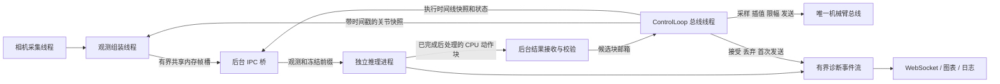

# Monitor 异步 Rollout 设计

初始设计提案：2026-09-26。实现方案已按下述复用约束修订。关联 [Bug 审核与修复计划](bug_audit_2026-09-26.md)。

当前实施状态：首批原生引擎适配已实现；本文件下方独立进程与完整时间线方案仍为设计候选。具体完成范围以 Bug 审核的“实施更新”和 ROADMAP 为准。

实施修订：用户要求尽量复用 LeRobot。当前优先扩展已有 `RTCInferenceEngine` / `ActionQueue` 的观测提供、CPU 发布及显式事件边界，Monitor 只提供适配；同步模式继续复用 `SyncInferenceEngine` 与现有 `PolicyWorker`。下文 spawn 服务、IPC 与独立时间线为后续候选，不是本轮前置要求。已有 `async_inference.RobotClient` 自行连接机器人，不直接接入 Monitor；若后续需要进程隔离，应先适配已有 PolicyServer/transport，而不是另写协议。

已实现的复用接口（LeRobot `79f1e10d`）：`RTCInferenceEngine.observation_provider` 在生产线程组装输入；`chunk_observer` 报告带 chunk ID 的生命周期；`ActionQueue.get_prefix_snapshot()` 返回同一消费索引的 raw/absolute 尾部；`get_with_metadata(blocking=False)` 避免控制侧等待队列锁。处理器完整 CPU 拷贝后才发布动作；reset 状态由推理所有者串行修改。Monitor 仅在命令成功发送后记录该 chunk 的 active，并使用每次运行独立的 timeline。

实际 CPU 边界：RTC 控制端拿到已完成 CPU tensor，六关节映射继续复用 LeRobot `make_robot_action`；sync worker 在后台完成这一步。没有新增常驻缓存服务，没有重写 guided/trained、相对动作重锚定和 ACT 融合算法。

## 1. 当前实现的准确判断

Monitor `loop.py:2917` 构造 LeRobot 引擎；RTC `start()` 启动后台线程，`_rtc_loop()` 调用 `predict_action_chunk()`；`get_action()` 从队列取动作。因此现有 RTC 已经具备推理与控制并发。

不足在端到端边界：总线线程仍采集/转换图像、构建观测、读取带锁的张量队列、转换动作并展开预览。sync 模式虽然已有 `PolicyWorker`，输入构建和结果转换也没有完全移走。当前界面通过队列变化推断 chunk 交接，不能凭这张图证明或否定真实并发。

本设计将“真正异步”定义为可验证的契约：**模型、相机处理、IPC 和可视化任一生产者变慢时，总线线程继续按自己的截止时间执行已接受的 CPU 轨迹；无可用轨迹时进入明确的保持/退出状态；Stop 不等待推理结束。**

Python/Windows 与串口驱动仍有调度、GIL 和设备 I/O 限制；此目标是可测的软实时隔离，不承诺硬实时。独立进程提供推理侧 GIL 和故障隔离；同进程 worker 只用于迁移或测试，不能替代进程隔离的验收。

## 2. 目标架构与所有权



| 所有者 | 职责 | 控制线程边界 |
|---|---|---|
| ControlLoop | 机械臂 I/O、任务状态、epoch、逻辑时间、唯一执行时间线、限幅、Stop/E-stop | 不调用相机转换、Torch、模型锁、阻塞 IPC、join、编码或图表展开 |
| ObservationAssembler | 接收最近关节状态、选择图像、尺寸/映射校验、时间戳与帧版本 | 只发布完整不可变快照；可丢旧快照，不能堆积逐帧任务 |
| InferenceService（`spawn` 进程） | 模型与处理器所有权、模型常驻、预处理、RTC 条件化、推理、后处理、批量 D2H | 每个模型实例只有一个执行所有者；不持有机械臂对象或串口 |
| IPC bridge | 图像槽租约、序列化、发送/接收、初步校验、worker 健康检查 | 消息与像素复制均不在总线线程；死亡时给控制端发状态 |
| Telemetry worker | 事件聚合、图表轨迹、摘要和文件写入 | 队列满则丢诊断并计数；不反压控制 |

推理进程内部仍可有 I/O 接收线程，模型相关操作由同一个推理线程串行执行。把现有驻留管理器的加载/卸载路径纳入命令调度，使用租约阻止卸载活动模型。不能仅把旧 `RTCInferenceEngine` 外面再套一层队列：那会同时存在两套消费索引、两次 delay 裁剪及不一致的 prefix。

建议复用 LeRobot 的模型 API、RTC guided/trained 算法、归一化和相对动作重锚定逻辑；新增由 Monitor 时间线驱动的 adapter。跨仓修改作为独立里程碑提交，不用长期 monkey-patch 私有队列实现协议。

## 3. 数据契约与有界传输

所有时间使用单调时钟；跨进程时间戳使用经过启动握手验证的同机时基，或把 worker 耗时作为 duration、在父进程打收发时间。将来远程部署不能直接比较两端 `perf_counter`。所有消息有 schema version 和 run identity。

| 消息 | 关键字段 | 数据形状 / 语义 |
|---|---|---|
| ObservationSnapshot | `run_id, epoch, observation_id, task_revision, state_time_ns, image_sequences, image_receive_times_ns, frame_handles` | 关节 `[J]`；每路原图 `[H,W,3] uint8`；模型预处理后 `[1,C,Hm,Wm]`，resize/normalize/H2D 全在 worker |
| PlanRequest | `request_id, observation_id, timeline_version, origin_step, origin_time_ns, policy_period_ns, prefix, committed_until_step, config_hash` | prefix 是同一已接受时间线的绝对动作 `[K,A]`；它描述控制器将执行的命令，不能从未接受候选块抽取 |
| ChunkResult | `run_id, epoch, task_revision, request_id, observation_id, parent_timeline_version, origin_step, dt_ns, cpu_ready_duration_ns, conditioned_delay, actions, joint_order, config_hash` | 模型输出 `[1,H,A]`；去 batch 后 `[H,A]`；一次后处理、一次批量转 CPU。发布时 float32 连续数组、有限值、完整关节顺序已验证 |
| ExecutionStatus | `timeline_version, next_logical_step, last_sent_step, last_sent_time_ns, buffer_end_step, holding, stop_reason` | 逻辑步、真实已发送命令、物理关节读数是三个不同量，不以成功发送次数代替逻辑时间 |
| ChunkEvent | `run_id, epoch, chunk_id, event_type, time_ns, action_index, reason` | 显式记录生成、CPU ready、接受、第一次发送、丢弃和退出；记录精度及丢失计数 |

容量规则：

- 最新观测邮箱容量 1，替换待处理观测；一个模型最多 1 个 in-flight 推理，不启动无界并发 CUDA 调用。
- 图像共享内存按相机使用固定槽位与状态（FREE/WRITING/READY/READING）；只有未被 reader 持有的槽可覆盖。无空闲槽则跳过本次发布；reader 复制或 H2D 完成后才归还，不能只凭序号而覆盖仍被 DMA 读取的像素。
- 候选结果容量 1；未完成接受/拒绝 ACK 前不开始依赖它的新请求。重复消息按 request ID 去重。旧 epoch/task/config/version 的结果拒绝。
- 控制端持有一个 active CPU plan 和至多一个候选 plan；H、A、相机数量与尺寸在启动时设上限。大块构建在桥线程完成，控制端只在短临界区交换不可变引用；try-lock 失败继续旧轨迹，不等待 worker。
- 推理请求必须基于一致的 observation + control timeline snapshot。控制端不等待取图；桥线程发现旧版本或超过年龄上限则重取。prefix / raw-normalized / processed-absolute 的映射使用同一 origin，禁止分别读取可能已前进的尾部。
- 诊断队列有界；控制状态变更还通过 latest state 发布，不能因丢一条遥测事件丢失 Stop。不要把 `multiprocessing.Queue.put_nowait()` 等同于端到端零阻塞，pickle/pipe 处理交给桥线程。

CPU 边界是强契约：即使模型默认 postprocessor 已经转 CPU，也再次验证返回值设备与所有权。若使用 pinned memory + nonblocking D2H，必须由 worker 等待对应 CUDA event 后发布；不能把仍在写入的 host buffer交给控制端。[PyTorch CUDA 语义](https://docs.pytorch.org/docs/main/notes/cuda.html)说明设备操作的异步执行和 CPU/GPU 拷贝的同步责任。

## 4. 独立时钟与动作时间线

保留三个配置量：模型动作频率 `f_policy`、机械臂输出频率 `f_control`、观测发布频率 `f_obs`。Record 的 Dataset FPS 独立。1×/2×/4×/6×/8×只改变输出采样频率，不改变模型训练动作的时间语义。

每个 chunk 的第 i 个动作对应 `origin_time + i * T_policy`。ControlLoop 在发送截止时间按该时间线采样；提高输出 Hz 时做明确配置的插值。错过发送 deadline 时跳到当前时刻，不连发所有历史动作。记录被跳过的逻辑步和实际发送间隔。

RTC 调度要看到实际执行规则：原点、插值延迟、限幅、暂停以及时间线版本。当前逐次“从上一目标向新目标过渡”的方式可能引入一个 policy 周期相位差；迁移时将它明确写为固定执行延迟或直接采样相邻轨迹点，不能一边按旧插值发命令、一边按无延迟轨迹生成 prefix。限幅造成显著偏离时进入重规划/holding，不能继续声称 committed prefix 已按预测执行。

policy 频率可以固定为 30 Hz，控制输出为 60 Hz；不应把模型调用频率也提升到 60 Hz。ACT temporal ensemble 对逐步调用语义有要求，异步 adapter 必须保留原状态更新方式。ACT 不是默认支持 RTC guided 的模型：可异步运行 `select_action`，不能未经验证把它改为 flow RTC 或改变 ensemble 算法。

## 5. RTC 的提前推理、前缀和结果合并

RTC 的目标是执行已有动作的同时生成后续动作，并条件化已承诺的前缀；异步基础设施与 guided/trained 算法分别配置。原方法与训练期条件化版本可参见 [RTC 论文](https://arxiv.org/abs/2506.07339) 和 [训练期 RTC](https://arxiv.org/abs/2512.05964)。本节的 transport、时钟和异常处理是针对 Monitor 的工程设计。

设 `T=1/f_policy`、H 为模型 chunk 步数、R 为当前剩余有效时间线步数、`L_budget` 为最近端到端“观测组装→推理→CPU ready→传输→接受”耗时的保守预算、J 为调度余量。建议触发阈值：

```text
D = ceil((L_budget + J) / T)
当 R <= D + margin_steps 且没有 in-flight 请求时发起推理。
必要容量条件：H > D + margin_steps。
```

预算应包含观测年龄；报告年龄与处理耗时两个独立值，避免重复相加。冷启动/compile warmup 单独统计，样本不足时使用配置的保守初值；稳定运行后用滚动高分位或保守上界更新。容量条件只是必要条件，连续无缺货还取决于持续吞吐与抖动。

例如 30 Hz、H=50、预算 200 ms、余量 40 ms，D=8；剩余 10 步时触发，推理期间控制器继续发送旧 plan。结果在约 8 步内可用，就在可修改的未来边界接入；60 Hz 输出仍只对 30 Hz 动作时间线插值。

具体协议：

1. 控制端发布一次一致的当前执行时间线快照。推理请求记录 origin、timeline version 和前 D 步 committed prefix；保留动作来源 task/revision。
2. worker 以这份观测为锚点，将绝对 prefix 变换成模型要求的相对/归一化 `[K,A]`。推理后反归一化和还原绝对动作仍使用同一观测锚点，不能用之后的关节状态重新解释整个输出。
3. worker 完成整块后处理与 CPU 拷贝后发候选结果。控制端最终检查 epoch/task/config、parent version、观测年龄、关节顺序/有限值，以及当前真正不可修改的前缀边界。
4. 控制端以 origin 到接受时刻经过的逻辑步数求有效后缀，保留已经承诺的 prefix，仅替换未来。不得改写已发送动作；不得由 worker 和控制端各裁一次 delay。将“接受”与“首个动作真实发送成功”分开打点。
5. trained RTC 要求实际延迟不超过本次条件化前缀、checkpoint 的训练最大 delay 和可用前缀长度。超过任一约束就拒绝本次结果、更新预算；连续失败进入 holding/failed。不能只把延迟 clamp 到上限后强行执行。
6. guided RTC 也不是任意延迟都有效。guided 使用现有前缀权重语义；结果迟到超出冻结边界/有效 horizon 时重新规划，不能无限拼接或把所有旧 tail 当作硬冻结。

启动与缺货必须特别处理：

- **Bootstrap**：没有旧 plan 时保持当前姿态；首次结果在 CPU ready 后建立新的执行原点，不按漫长冷启动时间删除整个首块。若观测已经过期或机械臂姿态变化超门槛，重新取观测推理。
- **运行中缺货**：短缺先保持最后已发送安全目标；超过配置门槛撤销当前执行 epoch，进入重新引导。holding 期间不能继续假装原轨迹在正常执行，也不能等结果返回后把旧动作从第一项重放。
- **长期不足**：若 H*T 小于持续端到端延迟或训练 delay 能力不足，异步架构无法制造缺失动作。提示调整推理配置、horizon 或模型；改变 policy Hz 必须明确改变时间语义，不能自动降频掩盖问题。

## 6. 观测新鲜度、停止与进程故障

`ObservationAssembler` 只选择 `enabled && feed_robot` 的相机。`show_main` 是显示设置。每个输入携带帧序号、接收时刻；设备提供可靠曝光时间时另存，不能把接收时刻冒充曝光时刻。

启动校验模型所需相机名称/映射/形状与 fresh frame；运行中对关节年龄、各相机年龄与最大时间差设门槛。最大年龄、缺货超时、关节速度/位置限制按机器人任务配置，并在启动时显示实际采用值；不能把某个示例阈值当作通用实机安全参数。

状态机：

```text
idle → loading → priming → running ↔ holding
                    任一活动状态 → stopping → idle
                    输入/推理/传输故障 → failed（撤销动作权限）
                    E-stop → estop
```

Stop/E-stop 首先在控制所有者处递增 epoch、撤销候选/活动计划、改变任务状态，并执行现有硬件停止策略。之后后台发 cancel。正在执行的 CUDA kernel 不承诺即时取消；迟到结果被身份校验丢弃。模型租约直到推理所有者确认退出后才可释放。

服务 heartbeat 与推理 deadline 分开：I/O 线程还活着不代表模型调用可返回。超过进程收尾期限，监督器关闭该服务并确认退出，然后清理共享内存租约、标记驻留实例丢失、按需重新启动/加载。终止推理进程不接触总线进程；若进程/GPU 驱动不能回收，显示明确故障并保持禁止启动，不承诺进程 kill 必然恢复设备。

reset / pause / task update 由 worker 所有者串行处理。控制端先撤销旧 epoch；worker 在推理边界 reset，旧结果失效。普通任务文字更新可选择在下个 chunk 接入；会改变安全意图的任务切换必须撤销旧计划。选择及影响在 API 中显式表达。

总线读写仍可能阻塞：测量串口 timeout、状态读取耗时与发送耗时，为同一总线读/写配置预算；总线调用进行中软件 E-stop 无法抢占驱动 I/O。独立推理不能解决这个硬件边界，M5 必须单独测量。

## 7. 常驻缓存、API 与兼容迁移

独立进程方案把 CUDA policy、processors 和 mutable session state 的所有权迁入 InferenceService。父进程保留 `PolicyResidencyProxy`，Library 的载入/卸载/进度与显存 API 通过模型 ID 路由；不把已加载 Torch 对象 pickle 给 child，也不 fork 已初始化的 CUDA。

现有 Rollout 与 Debug 必须指向同一服务与租约源；不能在父进程保留一套常驻模型又在 worker 再加载一份。进程重启后缓存状态从实际 worker registry 重建，UI 显示 resident lost / reloading，不伪装仍驻留。跨模型冷加载可排队；活动 rollout 期间限制加载/Debug 争用，并将 GPU 争用纳入时延诊断。

运行配置以 checkpoint 基线为源，每次会话构造副本并校验；热改白名单决定 reset/rebuild 行为，结构参数变化重新创建兼容实例。权重缓存身份、会话配置 hash 与动作 epoch 分离；相同权重不能自动等价于任意相同结构。

建议新增配置（字段名为提案）：

```yaml
execution:
  mode: async                 # legacy | async，先 opt-in
  worker: process             # process；thread 供迁移/测试
  observation_max_age_ms: ... # 按任务明确配置
  max_camera_skew_ms: ...
  underrun_timeout_ms: ...
  worker_stop_timeout_s: ...
  refill_margin_steps: ...
inference:
  type: rtc                   # 保留现有 sync | rtc 算法选择
  rtc:
    mode: guided              # trained 需要匹配的 checkpoint
```

`execution.mode` 表示执行隔离方式，`inference.type` 表示策略算法，避免把“后台 sync 策略”错误地命名为 RTC。旧的 `queue_threshold` 在兼容模式仍按原义工作；异步模式明确报告实际 refill budget，与旧字段冲突时拒绝而非静默覆盖。

推荐迁移：先实现协议及 fake worker，再提供 thread adapter 验证算法，然后迁移驻留管理与推理到 spawn 服务，最后将 UI 指向事件数据。旧模式保留作为回归基线，完成 GPU/实机验收后再决定默认开关。

## 8. 模块拆分与验收

建议新模块：`rollout_protocol.py`（有类型的消息与 shape 约定）、`observation_worker.py`、`action_timeline.py`、`inference_service.py`、`inference_transport.py`、`inference_adapters.py`。现有 `loop.py` 保留硬件所有者；`policy_residency.py` 拆出 parent proxy 与 worker registry；`rollout_timeline.py` 消费显式事件；`app.py` / `app.js` 暴露新模式与状态。

所有实现函数写完整类型标注，tensor shape 在契约/docstring 记录。不要为了“无锁”依赖未声明的 Python 引用赋值原子性；采用明确所有权、短锁与非阻塞访问策略。

| 验收层 | 场景 | 必须证明 |
|---|---|---|
| 确定性单元测试 | 假时钟、乱序/重复/旧 epoch 结果、变 Hz、bootstrap、队列空、超 horizon | 时间线不回退；过去不补发；冻结前缀不改写；停止后无旧动作复活 |
| 隔离故障注入 | 相机转换/模型/CPU 拷贝/预览分别阻塞 200 ms 或 2 s | 有旧 plan 时控制继续推进；无 plan 时按期保持；控制线程不调用这些函数；缓存容量固定 |
| 传输/进程 | worker 崩溃、IPC 阻塞、共享内存耗尽、重复 ACK、退出超时 | 控制不等待；帧无撕裂；资源有界并可回收；Library 驻留状态真实 |
| 算法 | RTC guided/trained、相对动作、delay 越界、观测锚点变化、ACT ensemble | trained 越界拒绝；prefix/归一化成对；ACT 语义不被异步调度改变 |
| CPU 契约 | 发布对象是 CPU 数组；在总线线程调用 Torch/图像转换的测试桩直接报错 | 默认和自定义 postprocessor 都不能把 CUDA 工作带回总线线程 |
| 生命周期 | 长推理中 Stop/E-stop/reset，快速重启，debug/卸载竞态 | 动作权限立即撤销，模型释放等待确认，旧租约不会影响新 run |
| GPU + 虚拟臂 | 有完整图像的真实策略；记录推理区间与发送时刻 | 单次长推理区间内仍有连续发送；丢弃 chunk 无 first_dispatched；不以纯 UI 图证明并发 |
| 实机 | 15/30/60 Hz；不同图像负载；受控安全轨迹 | 输出间隔 P50/P95/P99/max、missed deadlines、跟踪误差、停止延迟、总线 I/O 耗时分别报告 |

工程测量目标（待目标机器校准，非当前已达成结论）：排除机械臂 I/O 后控制路径 P99 开销小于输出周期的 10%；虚拟臂在有充足动作缓存时，注入 200 ms 推理延迟不产生相应的 200 ms 发送空洞；60 Hz 场景的 P99 间隔目标不超过 1.25 个周期。wall-clock 性能门槛放在专门的基准测试，CI 主要检查确定性契约，避免普通调度抖动造成伪失败。

持续记录 `observation_age_ms`、`camera_skew_ms`、`preprocess_ms`、`model_ms`、`postprocess_ms`、`cpu_ready_ms`、`transport_ms`、`buffer_remaining_ms`、`predicted_delay_steps`、`actual_delay_steps`、`underruns`、`stale_results`、`hold_reason`、`first_dispatched`。图表读取的是同一份执行事件与 CPU 计划，不再直接窥探 policy 内部 deque。

里程碑与提交粒度见 Bug 审核 M1–M6；本次 M0 仅完成设计与基线验证。下一步最小可交付是相机路由/配置覆盖修复，以及 fake worker 驱动的 CPU 时间线，随后接真实 RTC 和进程缓存。
